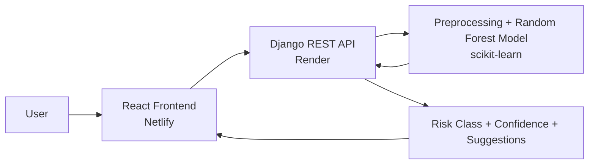
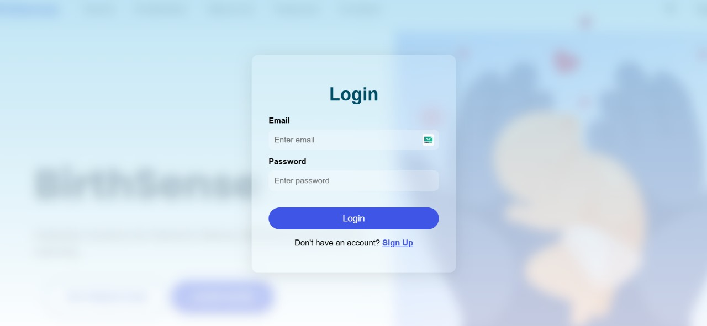
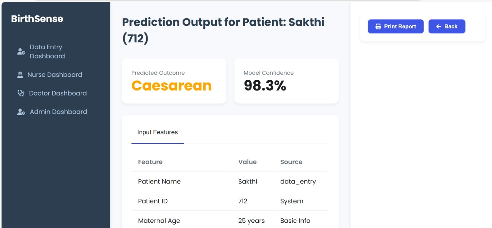

# 🤰 BirthSense

**Machine learning-powered maternal health risk prediction platform built as a full stack web application with a production-deployed REST API.**

[](https://birthsense.netlify.app)

---

## 🧩 Badges


---

## 🩺 Problem Statement

Maternal health complications remain a major challenge in many developing regions, where access to specialist care and continuous monitoring can be limited. Early machine learning-based risk screening can support healthcare workers by flagging potentially high-risk pregnancies faster. BirthSense is designed to provide quick, interpretable risk predictions that can help prioritize timely intervention, especially in resource-constrained settings including India.

---

## ✨ Features

- Predicts maternal pregnancy risk levels: **Low Risk / Medium Risk / High Risk**.
- Uses a trained **Random Forest** model on maternal health indicators.
- Accepts key inputs: **age, blood pressure, blood glucose, BMI, heart rate**.
- Returns a **risk category**, **confidence score**, and **actionable health suggestions**.
- Clean, user-friendly web interface for quick risk assessment workflows.
- Full stack architecture with a deployed frontend and production API.

---

## 🧱 Tech Stack

| Layer | Technology | Purpose |
|---|---|---|
| Frontend | React.js | User interface for data input and prediction results |
| Backend | Django + Django REST Framework | REST API for prediction requests and responses |
| Machine Learning | scikit-learn (Random Forest) | Classification of maternal health risk |
| Data Science | pandas, NumPy | Data preprocessing and model workflow |
| Dataset | UCI Maternal Health Risk Dataset | Training and evaluation data |
| Database (Dev) | SQLite | Local development database |
| Database (Prod) | PostgreSQL (Render) | Production persistence |
| Deployment (Frontend) | Netlify | Hosted live web client |
| Deployment (Backend) | Render | Hosted API service |
| Uptime Monitoring | BetterStack | Monitors backend and keeps service active |

---

## 🏗️ Architecture Overview



---

## 🔗 Live Demo

- **Frontend:** https://birthsense.netlify.app
- **Backend API:** _Add your Render API URL here_ (example: `https://your-api-name.onrender.com/api/predict/`)

When you open the live app, you can enter maternal health parameters and instantly receive a predicted risk class with confidence and recommendation-oriented output.

---

## 🖼️ Screenshots





---

## ⚙️ How It Works

1. **User Input Collection**  
   The frontend collects maternal health values (age, blood pressure, blood glucose, BMI, heart rate).

2. **Request to REST API**  
   The React client sends a structured JSON payload to the Django REST API endpoint.

3. **Preprocessing**  
   The backend validates and preprocesses incoming values to match model expectations.

4. **Random Forest Inference**  
   The trained scikit-learn Random Forest classifier predicts one of three classes.

5. **Post-processing & Explanation Layer**  
   The API maps output into readable labels (Low/Medium/High), includes confidence score, and appends actionable suggestions.

6. **Frontend Display**  
   The app renders prediction results in a clean, clinician-friendly format.

---

## 🚀 Getting Started (Local Setup)

### 1) Clone the repository

```bash
git clone https://github.com/<your-username>/BirthSense-Final-Year-Project.git
cd BirthSense-Final-Year-Project
```

### 2) Backend setup (Django + DRF)

```bash
cd backend
python -m venv .venv
source .venv/bin/activate  # Windows: .venv\Scripts\activate
pip install -r requirements.txt
python manage.py migrate
python manage.py runserver
```

Backend runs by default at: `http://127.0.0.1:8000/`

### 3) Frontend setup (React)

```bash
cd frontend
npm install
```

Create a `.env` file in `frontend/`:

```env
REACT_APP_API_URL=http://127.0.0.1:8000/api/predict/
```

Start the frontend:

```bash
npm start
```

Frontend typically runs at: `http://localhost:3000/`

---

## 🔐 Environment Variables

### Frontend (`frontend/.env`)

| Variable | Required | Example | Purpose |
|---|---|---|---|
| `REACT_APP_API_URL` | Yes | `http://127.0.0.1:8000/api/predict/` | Base URL / endpoint for prediction API |

### Backend (`backend/.env`)

| Variable | Required | Example | Purpose |
|---|---|---|---|
| `DEBUG` | Yes | `True` / `False` | Django debug mode |
| `SECRET_KEY` | Yes | `django-insecure-...` | Django cryptographic signing key |
| `ALLOWED_HOSTS` | Yes | `localhost,127.0.0.1,.onrender.com` | Allowed hostnames for deployment |
| `DATABASE_URL` | Prod | `postgres://...` | PostgreSQL connection on Render |
| `CORS_ALLOWED_ORIGINS` | Yes | `https://birthsense.netlify.app` | Allowed frontend origins |

> Adjust variable names if your project uses different settings modules/config patterns.

---

## 🧠 Model Details

- **Algorithm:** Random Forest Classifier (scikit-learn)
- **Dataset:** UCI Maternal Health Risk Dataset
- **Prediction Classes:** Low Risk, Medium Risk, High Risk
- **Model Accuracy:** **[Add your evaluated test accuracy here — e.g., 85.0%]**

---

## ☁️ Deployment

- **Frontend (Netlify):** Hosts the React production build for fast global delivery.
- **Backend (Render):** Hosts Django REST API and production inference endpoint.
- **Database (Render PostgreSQL):** Stores production data (SQLite used for local development).
- **BetterStack Monitoring:** Pings/monitors backend uptime to reduce cold starts and improve availability.

---

## 📘 What I Learned

- Built an end-to-end **machine learning** product by integrating a trained model into a production-grade **REST API**.
- Improved practical skills in **full stack** architecture, API contract design, and frontend-backend integration.
- Gained hands-on deployment experience across free-tier platforms (Netlify + Render) with production considerations.
- Learned to handle CORS, environment configuration, and reliable service uptime monitoring for real-world usage.

---

## 🤝 Connect

- **GitHub:** https://github.com/<your-username>
- **LinkedIn:** https://www.linkedin.com/in/<your-linkedin-username>/

If you are a recruiter or engineer reviewing this project, feel free to explore the live demo and share feedback.

---

## ⭐ Support

If you found this project useful, consider giving it a star to support continued improvements.
