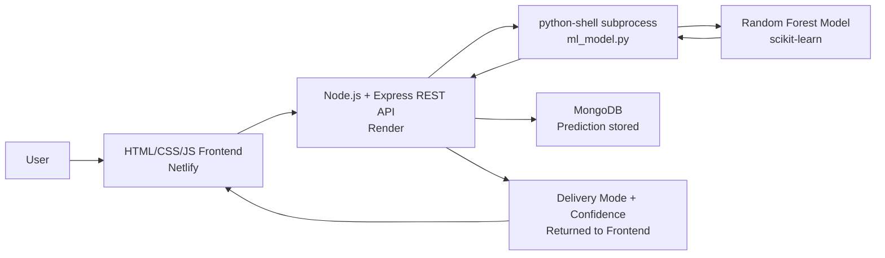
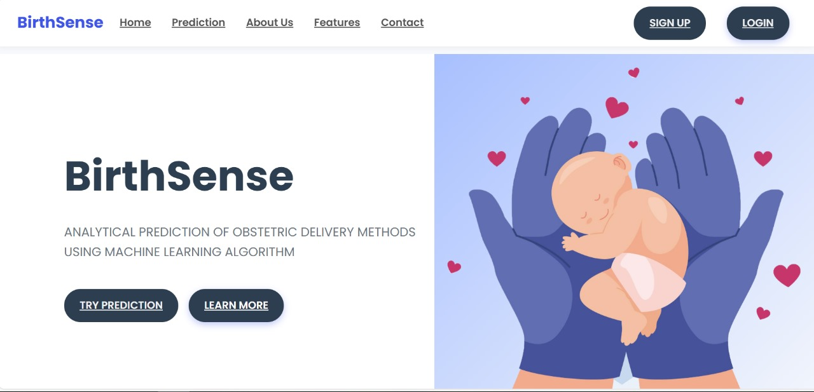

# 🤰 BirthSense

**Machine learning-powered childbirth mode prediction platform built as a full stack web application with a production-deployed REST API.**

[](https://birthsense.netlify.app)

---

## 🧩 Badges


---

## 🩺 Problem Statement

Planning for childbirth remains a major challenge in many developing regions, where access to specialist care, operating theatre availability, and continuous monitoring can be limited. Early machine learning-based delivery mode prediction can support healthcare workers by indicating whether a patient is more likely to require a Normal delivery or Caesarean (C-Section) delivery. BirthSense is designed to provide quick, interpretable delivery mode predictions that can help healthcare teams plan in advance, especially in resource-constrained settings including India.

---

## ✨ Features

- Predicts childbirth delivery mode: **Normal Delivery / Caesarean Delivery**.
- Uses a trained **Random Forest** model on 5,842 patient obstetric and health records.
- Accepts key inputs: **age, blood pressure, blood glucose, BMI, heart rate**.
- Returns a **delivery mode prediction**, **confidence score**, and **actionable planning suggestions**.
- Clean, user-friendly web interface for quick delivery planning workflows.
- Full stack architecture with a deployed frontend and production REST API (14 endpoints).

---

## 🧱 Tech Stack

| Layer | Technology | Purpose |
|---|---|---|
| Frontend | HTML, CSS, JavaScript | User interface for data input and prediction results |
| Backend | Node.js + Express.js | REST API for prediction requests and responses |
| ML Integration | python-shell (npm) | Invokes Python inference script as a subprocess from Node.js |
| Machine Learning | scikit-learn (Random Forest) | Classification of childbirth delivery mode |
| Data Science | pandas, NumPy | Data preprocessing and model workflow |
| Dataset | 5,842 patient obstetric records, 24 features | Training and evaluation data |
| Database | MongoDB | Persistent storage for patient records and prediction results |
| Deployment (Frontend) | Netlify | Hosted live web client |
| Deployment (Backend) | Render | Hosted API service |
| Uptime Monitoring | BetterStack | Monitors backend and keeps service active |

---

## 🏗️ Architecture Overview



---

## 🔗 Live Demo

- **Frontend:** https://birthsense.netlify.app
- **Backend API:** https://birthsense-api.onrender.com/api/predict/

When you open the live app, you can enter patient health parameters and instantly receive a predicted delivery mode with confidence and recommendation-oriented output.

---

## 🖼️ Screenshots




---

## ⚙️ How It Works

1. **User Input Collection**
   The frontend collects patient health values (age, blood pressure, blood glucose, BMI, heart rate).

2. **Request to REST API**
   The HTML/JS client sends a structured JSON payload to the Node.js/Express REST API endpoint.

3. **Preprocessing**
   The Express controller validates incoming values and builds the feature object.

4. **Python Subprocess Invocation**
   The backend uses `python-shell` to run `ml_model.py` as a subprocess, passing patient features as a JSON argument via `sys.argv`.

5. **Random Forest Inference**
   The Python script applies clinical pre-filter rules, then runs the trained scikit-learn Random Forest classifier and prints the result as JSON to stdout.

6. **Result Parsing & Storage**
   Node.js reads the final stdout line, parses the JSON prediction and confidence score, and persists the result to MongoDB.

7. **Frontend Display**
   The app renders prediction results in a clean, clinician-friendly format.

---

## 🚀 Getting Started (Local Setup)

### 1) Clone the repository

```bash
git clone https://github.com/bbalasubramani/BirthSense-Final-Year-Project.git
cd BirthSense-Final-Year-Project
```

### 2) Backend setup (Node.js + Express)

```bash
cd backend
npm install
```

Create a `.env` file in `backend/`:

```env
PORT=5000
MONGO_URI=your_mongodb_connection_string
```

Start the backend:

```bash
npm start
```

Backend runs by default at: `http://localhost:5000/`

### 3) Python ML setup

```bash
cd backend/ml_service
pip install -r requirements.txt
```

Ensure `delivery_model.joblib` is present in `backend/ml_service/`. If not, run:

```bash
python train_model.py
```

### 4) Frontend setup

Open `frontend/index.html` directly in a browser, or serve it with:

```bash
cd frontend
npx serve .
```

---

## 🔐 Environment Variables

### Backend (`backend/.env`)

| Variable | Required | Example | Purpose |
|---|---|---|---|
| `PORT` | Yes | `5000` | Express server port |
| `MONGO_URI` | Yes | `mongodb+srv://...` | MongoDB connection string |

---

## 🧠 Model Details

- **Algorithm:** Random Forest Classifier (scikit-learn)
- **Dataset:** 5,842 patient obstetric and health records, 24 features
- **Prediction Classes:** Normal Delivery, Caesarean Delivery
- **Train/Test Split:** 80% train, 20% test
- **Model Accuracy:** 85%+
- **Integration:** Invoked via `python-shell` npm package as a subprocess from Node.js

---

## ☁️ Deployment

- **Frontend (Netlify):** Hosts the static HTML/CSS/JS frontend for fast global delivery.
- **Backend (Render):** Hosts Node.js/Express REST API and Python inference subprocess.
- **Database (MongoDB):** Stores patient records and prediction results.
- **BetterStack Monitoring:** Pings backend `/api/health` endpoint to monitor uptime and reduce cold starts.

---

## 📘 What I Learned

- Built an end-to-end **machine learning** product by integrating a trained Python model into a production-grade Node.js REST API using subprocess communication.
- Designed cross-runtime JSON serialization between Node.js and Python via `python-shell`.
- Gained hands-on deployment experience across Netlify and Render with environment-based configuration.
- Learned to handle CORS, uptime monitoring, and MongoDB persistence in a full stack production workflow.

---

## 🤝 Connect

- **GitHub:** https://github.com/bbalasubramani
- **LinkedIn:** https://www.linkedin.com/in/balasubramani-dev/

If you are a recruiter or engineer reviewing this project, feel free to explore the live demo and share feedback.

---

## ⭐ Support

If you found this project useful, consider giving it a star to support continued improvements.
